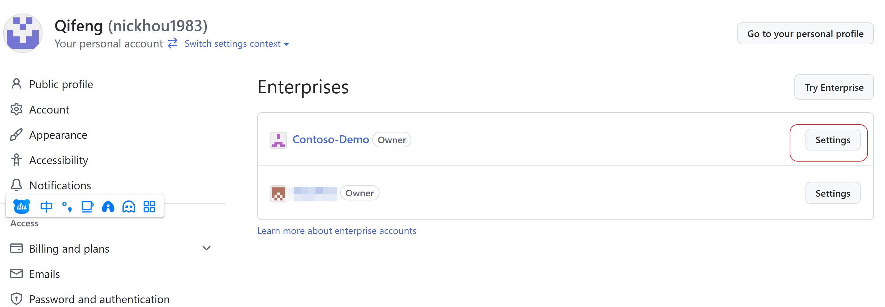
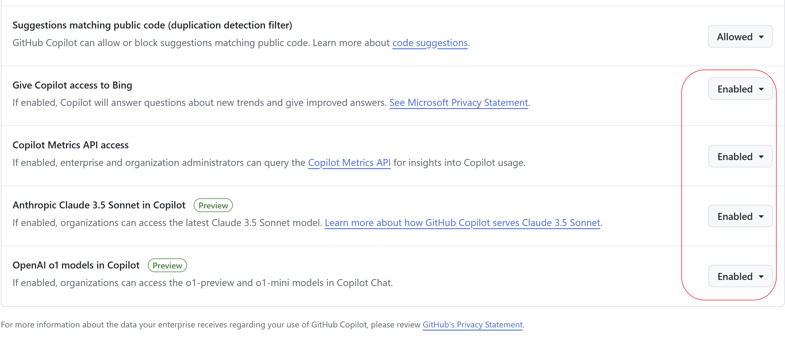

# 如何为Github Copilot 启用多模型支持

## 介绍
Github Copilot 是一个GitHub开发的AI代码助手。它可以帮助开发人员编写代码，提供代码建议和自动完成。在本文中，我们将介绍如何为Github Copilot 启用多模型。

## 说明

### 模型说明

当前Github Copilot 支持多模型，每个模型都有自己的特点和优势。多模型当前仅适用于Github Copilot Chat。

- GPT 4o: 默认模型，具备较强推理能力，响应速度快，适用于日常开发、代码重构、生成测试用例等场景。不限制请求次数；
- OpenAI o1-preview: 具备高级推理能力，但是响应速度较慢，适用于代码性能调优、复杂算法生成、代码Bug诊断、代码重构、生成集成测试用例等场景。每天限制10次请求；
- OpenAI o1-mini： 相较于o1-preview，o1-mini具备平衡的推理能，但是响应速度更快，每天限制50次请求；
- Claude 3.5 Sonnet: Claud3.5 当前不针对中国地区用户开放，通过代理后可以使用，具备较强的推理能力，当前处于评估阶段，不适合生产环境使用；

### 版本要求

1. 当前仅VSCode支持多模型，其他编辑器暂不支持；
2. 请确保更新到VSCode 1.95.0或更高版本。Github Copilot Chat 建议更新到最新版本；

### 网络要求（非常重要）

Github 在11月4号更新了Copilot服务的网络域名，请确保在代理或者防火墙上开放以下域名列表：
- https//github.com/
- https://github.com/login/*
- https://api.github.com/user
- https://api.github.com/copilot_internal/*
- https://github.com/settings/two_factor_checkup.*
- https://github.com/favicon.ico"
- https://github.com/session
- https://github.com/sessions.*
- https://github.githubassets.com/assets.*
- https://default.exp-tas.com
- https://default.exp-tas.com/vscode/ab
- https://vscode.dev/redirect.*
- https://copilot-telemetry.githubusercontent.com/telemetry
- https://default.exp-tas.com
- https://copilot-proxy.githubusercontent.com	
- https://origin-tracker.githubusercontent.com
- https://copilot-telemetry-service.githubusercontent.com/.*
- https://api.github.com/teams/.*
- ___https://*.githubcopilot.com___
- ___https://*.business.githubcopilot.com___
- ___https://*.enterprise.githubcopilot.com___

__其中加粗的三个域名是本次更新新加的，如果你之前已经配置了代理或防火墙，请确保一定更新这三个域名。__

## 启用步骤

1. 使用Github管理员账户登录 https://github.com
2. 进入企业 或 组织配置页面，如下图所示：

3. 选择需要启用多模型的企业或组织，点击“Settings”，进入设置页面，如下图所示：

4. 选择"Policies" - "Copilot" -"Policies"，如下图所示：

5. 确保如下几个预览功能已经开启：

## 客户端配置

确保上述配置均完成后，建议客户端将VSCode 和 Github Copilot Chat 更新到最新版本，然后重启VSCode，即可使用多模型功能。

最低版本需求：

VSCode: 1.95+
Github Copilot Chat: 0.22+

